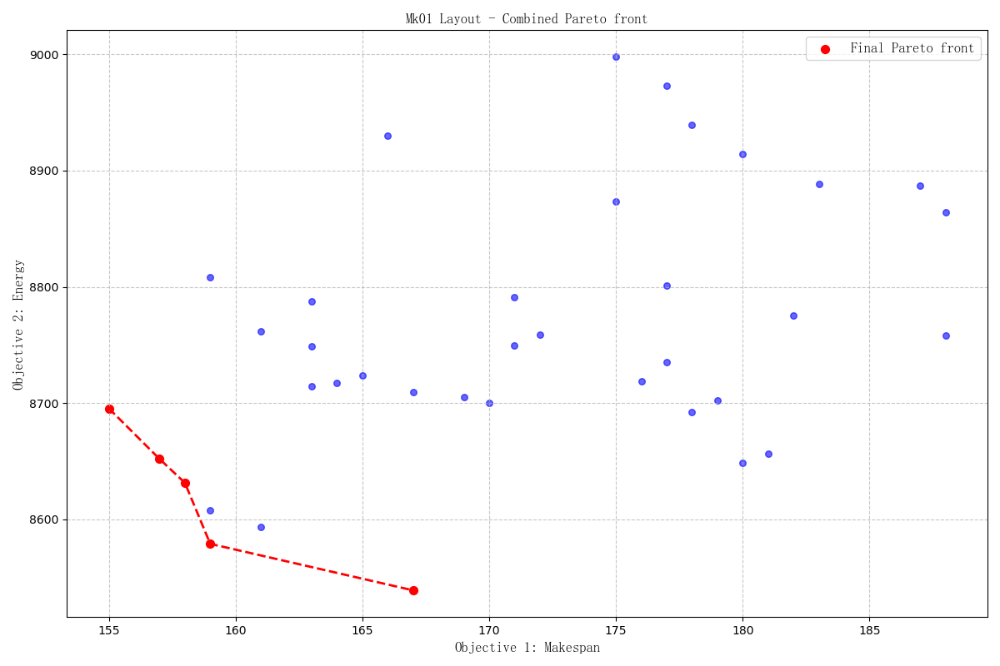

# NSGA-II-FJSP-AGVs

A Python implementation of NSGA-II for the Flexible Job Shop Scheduling Problem with Automated Guided Vehicles (FJSP-AGVs), with two optimization objectives:

- `Makespan`
- `Total energy consumption`

This repository is intended as a lightweight research baseline. It includes the core evolutionary solver, benchmark instance parsers, schedule decoding, Pareto-front export, Pareto plotting, and complete Gantt-chart generation for the best-`Makespan` Pareto solution.

## Highlights

- Multi-objective optimization based on `NSGA-II`
- Three-part chromosome representation:
  operation sequence, machine assignment, and AGV assignment
- `POX` crossover for operation sequencing
- `UX` crossover for machine and AGV genes
- Mutation operators for operation, machine, and AGV decisions
- Fast non-dominated sorting and crowding-distance-based environmental selection
- Energy modeling for:
  machine processing, machine idle time, AGV loaded travel, and AGV empty travel
- Batch experiments with Pareto-history export and Pareto plots
- Complete Gantt-chart generation after optimization:
  machine processing, AGV empty travel, and AGV loaded travel

## Repository Structure

```text
NSGA-II-FJSP-AGVs/
|-- datasets/
|   `-- FJSP_AGVs/
|       |-- Bilge and Ulusoy/
|       `-- Brandimarte_Data/
|-- nsga_fjsp_agvs/
|   |-- NSGA_II.py
|   |-- binary_tournament_selection.py
|   |-- decoder.py
|   |-- environment_selection.py
|   |-- operators.py
|   |-- parser.py
|   `-- problem.py
|-- utils/
|   |-- performance_test.py
|   `-- recorder.py
|-- results/
|-- main.py
`-- README.md
```

## Requirements

- Python 3.10+
- Required package: `numpy`
- Optional packages: `matplotlib`, `tqdm`

Install dependencies with:

```bash
pip install numpy matplotlib tqdm
```

If you only want to run the optimizer without plotting, `numpy` is the only required dependency.

## Quick Start

Run the default example:

```bash
python main.py
```

Current default configuration in `main.py`:

- Dataset: `Bilge and Ulusoy`
- Instance: `Jobset01`
- Layout: `Layout1`
- Stopping criterion: `max_fe = 10000`
- Population size: `100`
- Crossover probability: `0.9`
- Mutation probability: `0.15`

Typical console output:

```text
Stopping criterion: 10000 function evaluations
Final Pareto front (makespan, energy):
Solution 1: makespan = 73.00, energy = 5773.00
Solution 2: makespan = 74.00, energy = 5694.00
Solution 3: makespan = 75.00, energy = 5669.00
Gantt chart saved to: results/Bilge and Ulusoy/Jobset01_Layout1/best_makespan_gantt.png
```

The exact Pareto front may vary between runs if no random seed is fixed.

## Output Files

After running `main.py`, the solver will:

- Print the final Pareto front in the console
- Select the individual with the minimum `Makespan` from the final Pareto front
- Decode that individual again with detailed scheduling information
- Generate a complete `16:9` Gantt chart including:
  machine processing, AGV empty travel, and AGV loaded travel

Default output path:

```text
results/<dataset>/<instance>_<layout>/best_makespan_gantt.png
```

## Batch Experiments

To perform repeated runs, save Pareto history, export CSV files, and generate Pareto plots, run:

```bash
python utils/performance_test.py
```

This script can:

- Run a selected dataset multiple times
- Save Pareto-front history for each run
- Merge Pareto points across runs
- Export result tables as CSV files
- Generate scatter plots for Pareto fronts

Example generated files:

- `all_pareto_points.csv`
- `final_pareto_front.csv`
- `pareto_fronts.png`
- `combined_pareto_front.png`
- `history/pareto_history_run_XX.csv`

## Supported Datasets

The repository currently includes two benchmark groups:

- `datasets/FJSP_AGVs/Bilge and Ulusoy`
- `datasets/FJSP_AGVs/Brandimarte_Data`

Each experiment uses:

- An instance file such as `Jobset01.txt` or `Mk01.txt`
- A transport-layout file such as `Layout1.txt` or `Layout.txt`

## Objective Definition

The solver optimizes:

1. `Makespan`
2. `Total Energy`

The total energy value includes:

- Machine processing energy
- Machine idle energy
- AGV empty-travel energy
- AGV loaded-travel energy

## Main Modules

- `nsga_fjsp_agvs/problem.py`: problem definition, individual creation, initialization, crossover, and mutation
- `nsga_fjsp_agvs/decoder.py`: objective evaluation and detailed schedule decoding
- `nsga_fjsp_agvs/NSGA_II.py`: NSGA-II main loop
- `nsga_fjsp_agvs/environment_selection.py`: non-dominated sorting and crowding-distance selection
- `nsga_fjsp_agvs/operators.py`: initialization, crossover, and mutation operators
- `utils/recorder.py`: Pareto-front reporting and complete Gantt-chart plotting
- `utils/performance_test.py`: repeated experiments, statistics, CSV export, and Pareto plotting

## Example Results

Example result folders:

- `results/Bilge and Ulusoy/Jobset01_Layout1/`
- `results/Brandimarte_Data/Mk01_Layout/`

Example Pareto plot:



Example Gantt chart:


## Customization

You can directly modify parameters in `main.py` or `utils/performance_test.py`, for example:

- Dataset and layout selection
- `max_fe`
- Population size `pop_size`
- Crossover probability `cr`
- Mutation probability `mu`
- Number of repeated runs `num_runs`
